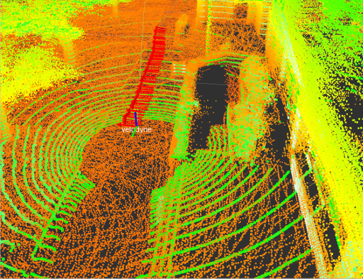
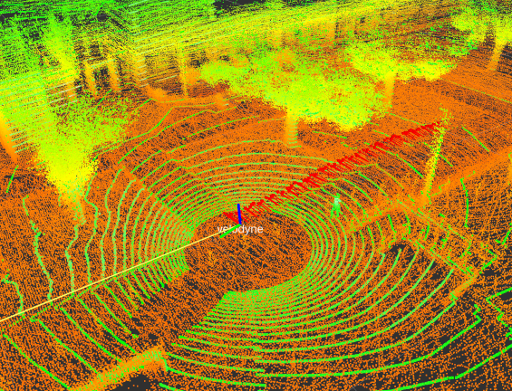

# hdl_localization
***hdl_localization*** is a ROS package for real-time 3D localization using a 3D LIDAR, such as velodyne HDL32e and VLP16. This package performs Unscented Kalman Filter-based pose estimation. It first estimates the sensor pose from IMU data implemented on the LIDAR, and then performs multi-threaded NDT scan matching between a globalmap point cloud and input point clouds to correct the estimated pose. IMU-based pose prediction is optional. If you disable it, the system uses the constant velocity model without IMU information.

Video:<br>
[](https://youtu.be/1EyF9kxJOqA)

[](https://travis-ci.org/koide3/hdl_global_localization)

## Requirements
***hdl_localization*** requires the following libraries:
- PCL
- OpenMP

The following ros packages are required:
- pcl_ros
- [ndt_omp](https://github.com/koide3/ndt_omp)
- [fast_gicp](https://github.com/SMRT-AIST/fast_gicp)
- [hdl_global_localization](https://github.com/koide3/hdl_global_localization)

## Installation

```bash
cd /your/catkin_ws/src
git clone https://github.com/koide3/ndt_omp
git clone https://github.com/SMRT-AIST/fast_gicp --recursive
git clone https://github.com/koide3/hdl_localization
git clone https://github.com/koide3/hdl_global_localization

cd /your/catkin_ws
catkin_make -DCMAKE_BUILD_TYPE=Release

# if you want to enable CUDA-accelerated NDT
# catkin_make -DCMAKE_BUILD_TYPE=Release -DBUILD_VGICP_CUDA=ON
```

### Support docker :whale:  

Using docker, you can conveniently satisfy the requirement environment.  
Please refer to the repository below and use the docker easily.  

- [Taeyoung96/hdl_localization_tutorial](https://github.com/Taeyoung96/hdl_localization_tutorial)

## Parameters
All configurable parameters are listed in *launch/hdl_localization.launch* as ros params.
The estimated pose can be reset using using "2D Pose Estimate" on rviz

## Topics
- ***/odom*** (nav_msgs/Odometry)
  - Estimated sensor pose in the map frame
- ***/aligned_points***
  - Input point cloud aligned with the map
- ***/status*** (hdl_localization/ScanMatchingStatus)
  - Scan matching result information (e.g., convergence, matching error, and inlier fraction)

## Services
- ***/relocalize*** (std_srvs/Empty)
  - Reset the sensor pose with the global localization result
  - For details of the global localization method, see [hdl_global_localization](https://github.com/koide3/hdl_global_localization)

## Example

Example bag file (recorded in an outdoor environment): [hdl_400.bag.tar.gz](http://www.aisl.cs.tut.ac.jp/databases/hdl_graph_slam/hdl_400.bag.tar.gz) (933MB)

```bash
rosparam set use_sim_time true
roslaunch hdl_localization hdl_localization.launch
```

```bash
roscd hdl_localization/rviz
rviz -d hdl_localization.rviz
```

```bash
rosbag play --clock hdl_400.bag
```

```bash
# perform global localization
rosservice call /relocalize
```

 

If it doesn't work well or the CPU usage is too high, change *ndt_neighbor_search_method* in *hdl_localization.launch* to "DIRECT1". It makes the scan matching significantly fast, but a bit unstable.

## Related packages

- [interactive_slam](https://github.com/koide3/interactive_slam)
- <a href="https://github.com/koide3/hdl_graph_slam">hdl_graph_slam</a>
- <a href="https://github.com/koide3/hdl_localization">hdl_localization</a>
- <a href="https://github.com/koide3/hdl_global_localization">hdl_global_localization</a>
- <a href="https://github.com/koide3/hdl_people_tracking">hdl_people_tracking</a>


Kenji Koide, Jun Miura, and Emanuele Menegatti, A Portable 3D LIDAR-based System for Long-term and Wide-area People Behavior Measurement, Advanced Robotic Systems, 2019 [[link]](https://www.researchgate.net/publication/331283709_A_Portable_3D_LIDAR-based_System_for_Long-term_and_Wide-area_People_Behavior_Measurement).

## Contact
Kenji Koide, k.koide@aist.go.jp

Active Intelligent Systems Laboratory, Toyohashi University of Technology, Japan [\[URL\]](http://www.aisl.cs.tut.ac.jp)
Human-Centered Mobility Research Center, National Institute of Advanced Industrial Science and Technology, Japan  [\[URL\]](https://unit.aist.go.jp/rirc/en/team/smart_mobility.html)


